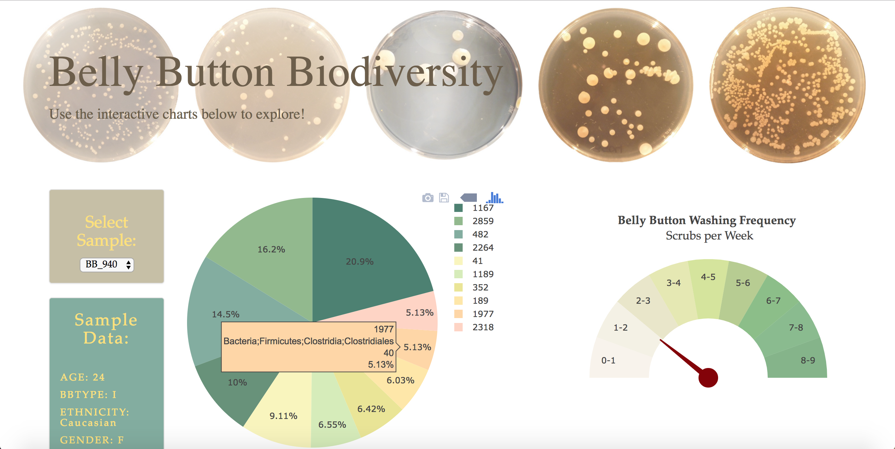
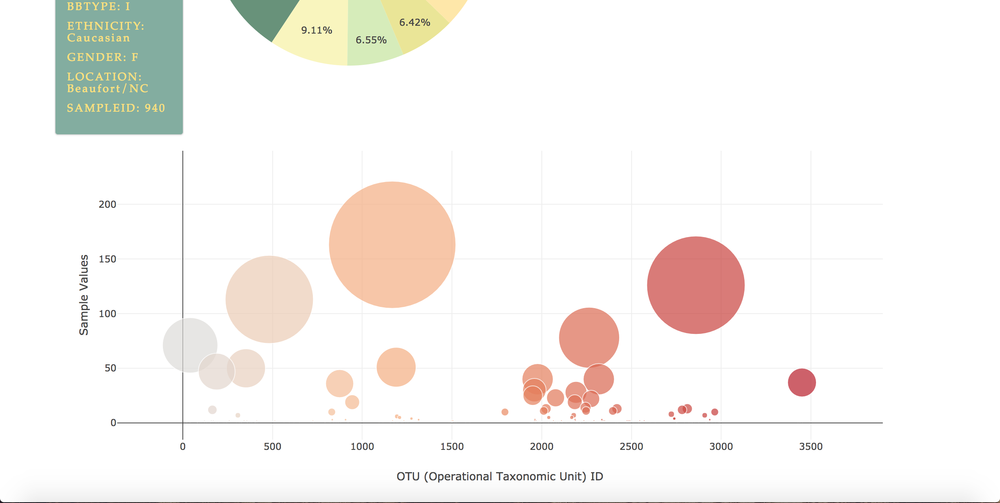

# Belly Button Biodiversity: Interactive Visualizations and Dashboard
- Used Flask to design an API for belly button biodiversity dataset and to serve the HTML and JavaScript required for my dashboard page. 
- Created app routes for API by using queries to sqlite database with Flask SQLAlchemy.
- Used Plotly.js and DOM manipulation to build interactive charts for dashboard.
- Used CSS Bootstrap and HTML for dashboard design.
- Deployed to Heroku: https://explorebellybutton.herokuapp.com/

